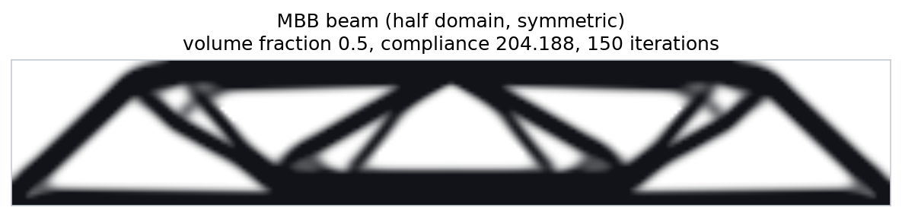
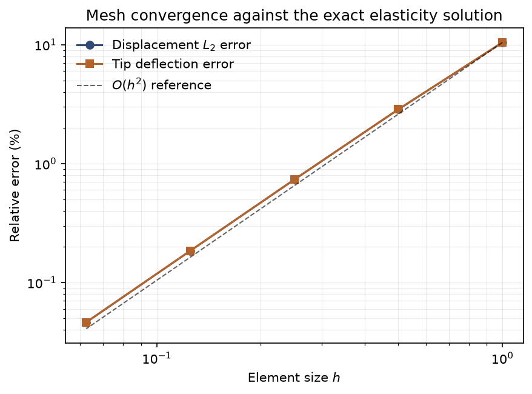
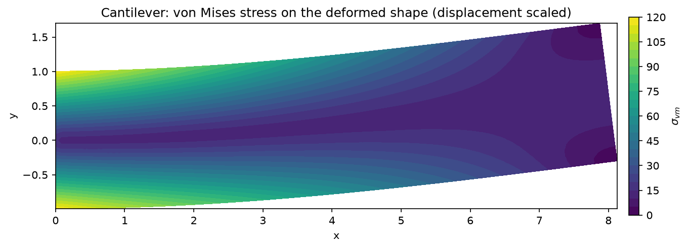
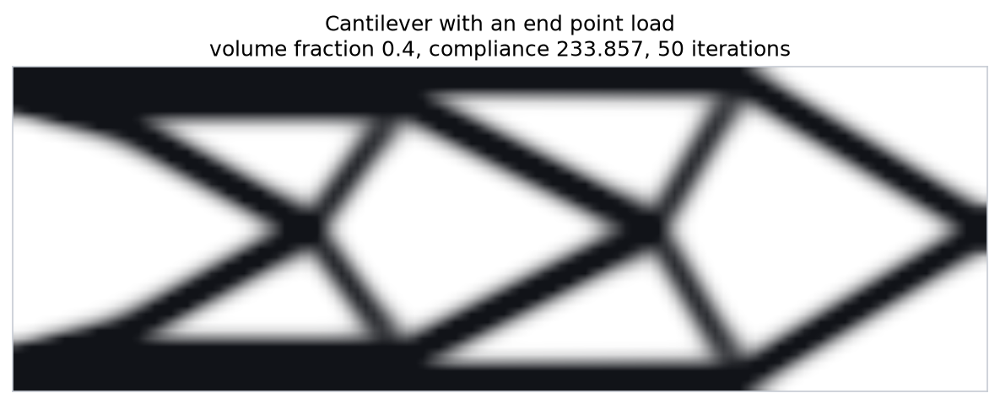
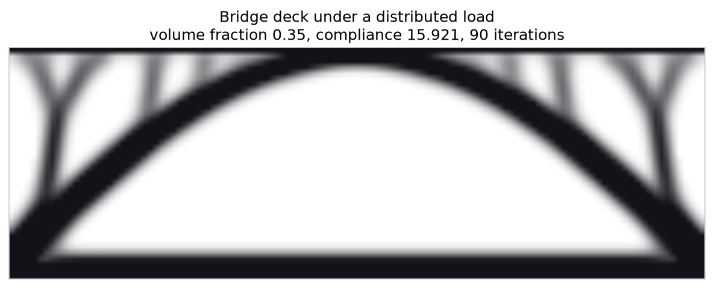
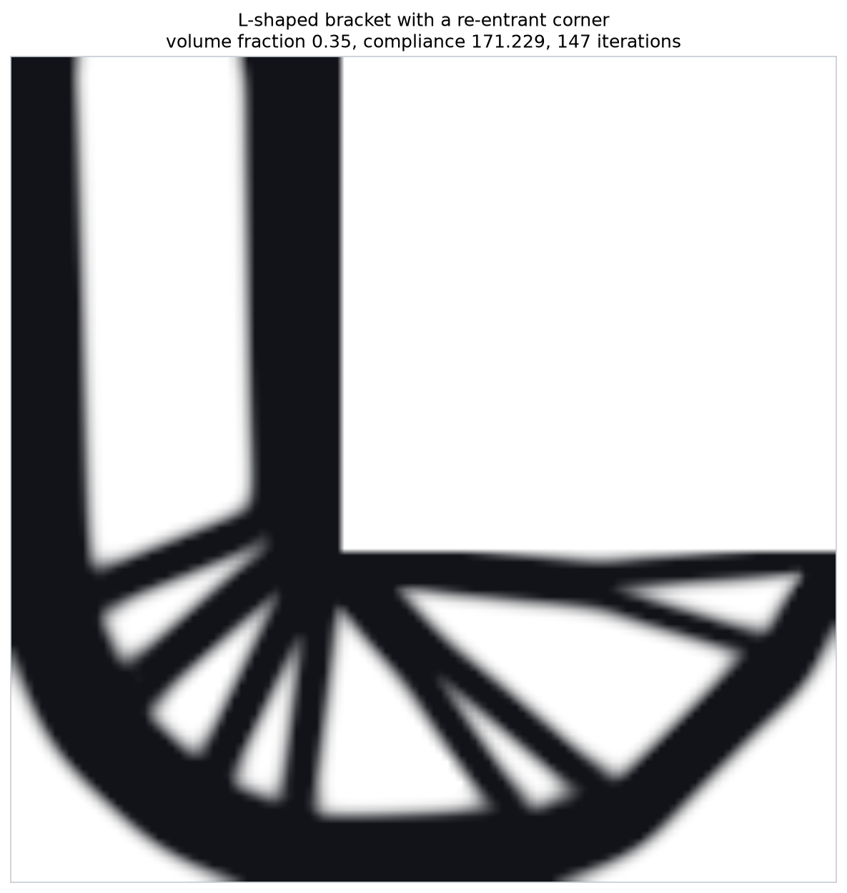
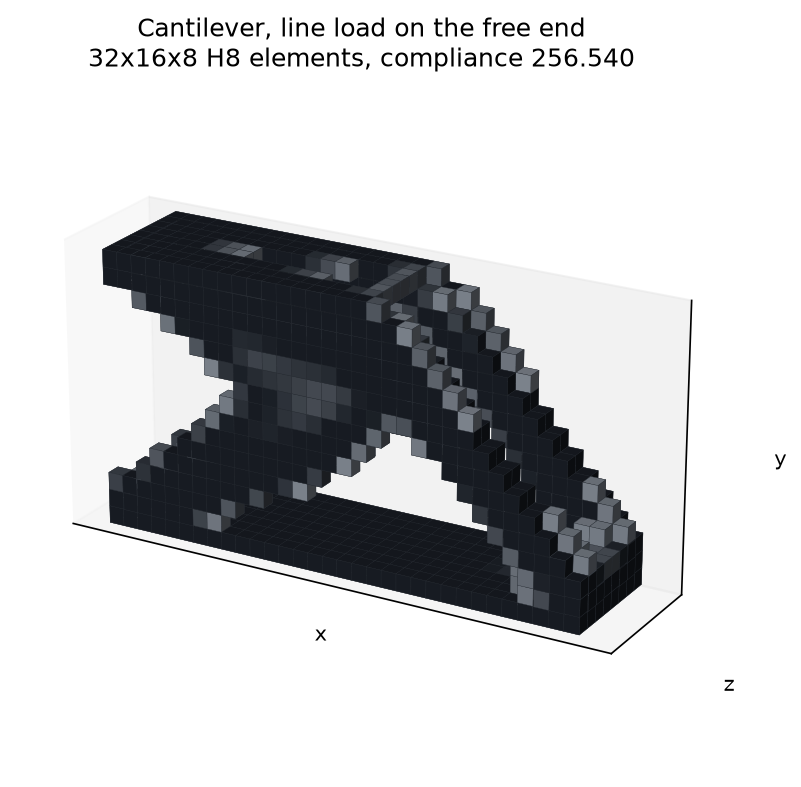
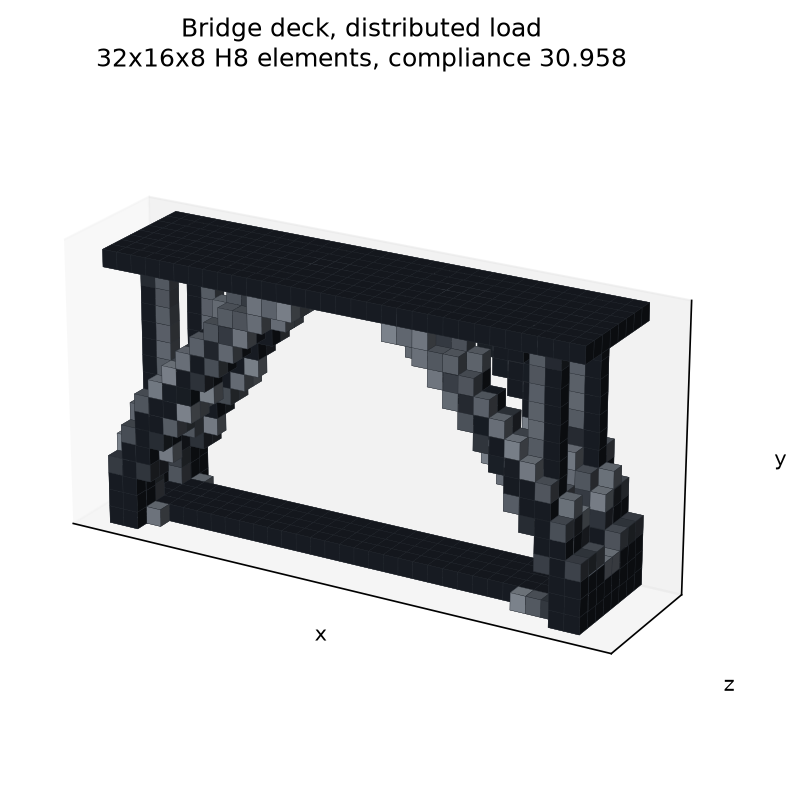
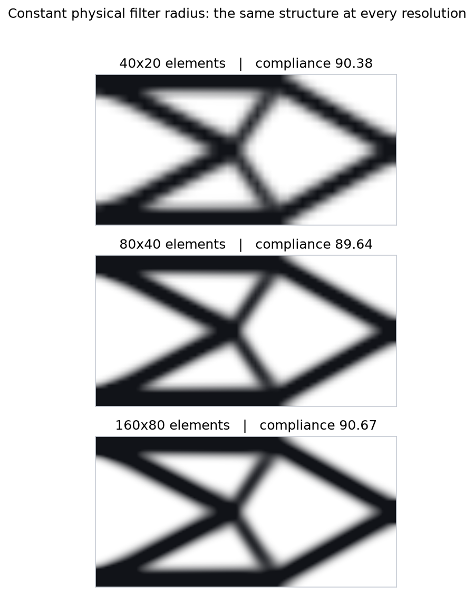
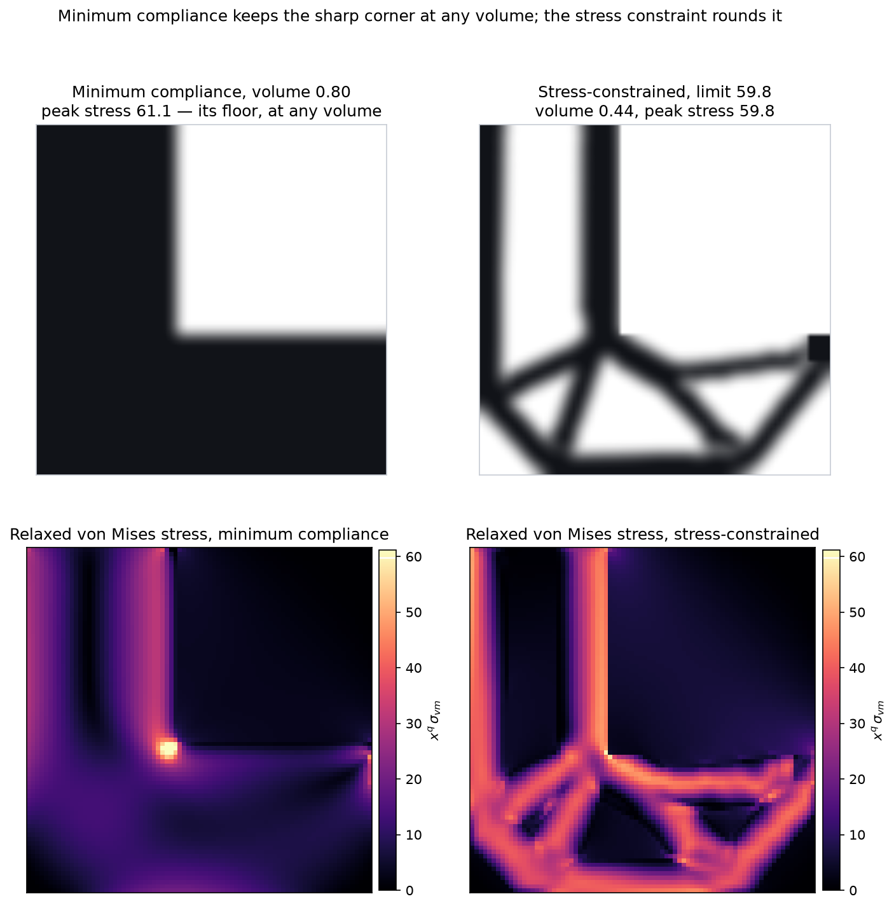

# Finite Element Solver and Topology Optimiser

A linear elasticity finite element solver written from scratch in Python, in two
and three dimensions, verified against closed-form elasticity solutions, and
extended into topology optimisers that use the same solver as their engine:
minimum compliance by SIMP, and minimum volume under a von Mises stress limit.

Nothing here wraps a commercial package. The element stiffness matrices, the
sparse assembly, the constraint handling, the stress recovery, the compliance and
stress sensitivities, the optimality criteria update and the Method of Moving
Asymptotes are all implemented directly.



## What it does

**Solver.** Four-node quadrilateral (Q4) elements for plane stress or plane
strain, and eight-node hexahedral (H8) elements for solids, integrated with 2×2
and 2×2×2 Gauss rules. Sparse assembly with a precomputed connectivity pattern,
prescribed displacements handled by static partitioning rather than a penalty,
consistent nodal loads from distributed edge and face tractions, and stress
recovery by Gauss-point extrapolation with nodal averaging. Direct factorisation
in 2D; warm-started Jacobi-preconditioned conjugate gradients in 3D, where it is
four times faster.

**Compliance optimiser.** Minimum compliance by the SIMP method in 2D and 3D,
with analytical sensitivities, a choice of sensitivity or density filter,
optimality criteria updates driven by a bisection search on the volume
multiplier, and support for regions forced solid or void.

**Stress-constrained optimiser.** Minimum volume subject to a von Mises stress
limit: qp-relaxation of the stress singularity, p-norm aggregation with adaptive
scaling, adjoint sensitivities, and a from-scratch Method of Moving Asymptotes to
drive a constraint the optimality criteria cannot handle.

## Verification

The solver is checked against the end-loaded cantilever of Timoshenko and
Goodier — a complete solution of the elasticity equations, not a beam theory
approximation. The exact displacement field is imposed on the supported end and
the exact parabolic shear traction on the loaded end, so the only error present
is discretisation error.

```
      mesh  elements    DOFs        tip v   tip err  ||u|| err  ||vm|| err
--------------------------------------------------------------------------
   8x2            16      54     2.390605   10.464%    10.449%     16.897%
  16x4            64     170     2.593498    2.865%     2.862%      6.119%
  32x8           256     594     2.650382    0.735%     0.734%      2.040%
  64x16         1024    2210     2.665062    0.185%     0.185%      0.678%
 128x32         4096    8514     2.668763    0.046%     0.046%      0.229%

  Observed displacement convergence rate: O(h^1.96)
  Observed stress convergence rate:       O(h^1.56)
```

Tip deflection converges to **0.046% of the exact value**, and the displacement
error falls at the O(h²) rate the bilinear element is expected to deliver.



The reference deflection is `v(L,0) = PL³/3EI + P(4+5ν)c²L/6EI`. The second term
is transverse shear, worth **4.1%** of the total for this beam and entirely
absent from Euler–Bernoulli theory. A solver that merely reproduced beam theory
would fail this test; the test suite asserts the shear contribution explicitly.

Further checks run as unit tests:

| Check | What it proves |
| --- | --- |
| Element stiffness vs. the published matrix in Andreassen et al. (2011) | Correct to machine precision (1.7 × 10⁻¹⁶) |
| Patch test on a mesh with randomly displaced interior nodes | Constant strain reproduced exactly on distorted elements |
| Rank of the free element stiffness matrix | Exactly 5 — three rigid body modes and no spurious mechanisms |
| Compliance sensitivity vs. central finite differences | Analytical gradient correct to 1 part in 10⁴ |
| Support reactions vs. applied load | Global equilibrium satisfied to 10⁻⁸ |



## Optimised layouts

Each layout below is produced by the verified solver, on a 120×40 grid, in
roughly ten seconds.

| | |
| --- | --- |
|  |  |

The bridge case is worth a second look: given only a deck to keep solid, supports
at the two lower corners, and a distributed load, the optimiser converges on an
arch. Nobody told it about arches.



The L-bracket fans a set of struts out to the loaded tip, but keeps the sharp
re-entrant corner — where the elasticity solution is singular and where real
brackets crack. Minimum compliance has no reason to avoid it. The
[stress-constrained optimiser](#stress-constrained-design) does.

## Three dimensions

The same solver and optimiser run unchanged on hexahedral meshes: the model reads
its dimension from the mesh and dispatches to the H8 element, and the SIMP loop,
filter and optimality criteria update are written against element indices rather
than a grid shape.

| | |
| --- | --- |
|  |  |

Both run on a 32×16×8 grid (4,096 elements, 15,147 DOFs) at under a second per
iteration. In three dimensions the fill-in of a sparse factorisation makes the
direct solver several times slower than an iterative one, so the 3D path uses
Jacobi-preconditioned conjugate gradients warm-started from the previous
iteration's displacements: 0.59 s per solve against 2.29 s for the factorisation,
with the compliance agreeing to thirteen digits.

The H8 element is verified the same way as the Q4: against a closed-form
elasticity solution rather than a beam approximation. The reference is
Saint-Venant's pure bending of a prismatic bar, whose displacement field is
quadratic and includes the anticlastic curvature of the cross-section — the
Poisson-ratio coupling a 2D model cannot represent. With exact displacements on
one end face and the exact moment traction integrated over the other:

```
      mesh    DOFs   ||u|| err
  8x2x1       162     11.66%
 16x4x2       765      3.22%
 32x8x4      4455      0.83%
 64x16x8    29835      0.21%

  Observed convergence rate: O(h^1.94)
```

The fully integrated trilinear hexahedron is known to produce spurious transverse
normal stresses in bending; the test suite asserts that they decay under
refinement (17.5% → 2.5% of the bending stress across the sequence) while the
bending stress itself is recovered to 2%. Alongside that: a 3D patch test on a
randomly distorted brick mesh reproduces constant strain to 10⁻¹⁰, a bar in
uniaxial tension reproduces the exact strain and full Poisson contraction to
10⁻¹², and the free element has rank exactly 18 — six rigid body modes, no
spurious mechanisms.

## Why the filter matters

Unregularised, this optimisation problem is ill-posed. Two consequences are
measured in `examples/filter_study.py`.

**Checkerboarding.** The unfiltered optimiser drives the design towards
alternating solid and void elements: a pattern the Q4 element space rewards, with
no physical length scale, that no process can manufacture. Filtering reduces the
checkerboard measure by a factor of 5.

```
variant                 rmin  compliance  checkerboard  greyness
----------------------------------------------------------------
No filter                0.0      85.917        0.0505      0.4%
Sensitivity filter       2.0      82.993        0.0133     14.7%
Density filter           2.0      87.282        0.0100     18.5%
```

The compliance column is deliberately *not* the argument. The filter also imposes
a minimum member size, and that constraint has a real stiffness cost, so filtered
compliance moves with the filter radius for reasons unrelated to checkerboarding.

**Mesh independence.** The property that actually makes a result trustworthy:
holding the filter radius fixed in physical units, the optimised compliance is
reproduced to **1.1% across a sixteen-fold increase in element count**, and the
structure is visibly the same at every resolution.

```
      mesh  elements  rmin (elem)  compliance  checkerboard
-----------------------------------------------------------
  40x20          800          1.5      90.380        0.0293
  80x40         3200          3.0      89.640        0.0084
 160x80        12800          6.0      90.673        0.0021
```



## Stress-constrained design

Minimum compliance says nothing about whether the part will break. Compliance is
an integral over the whole structure, so a local hot spot barely moves it — which
is why the compliance-optimal L-bracket keeps the sharp re-entrant corner where a
real bracket cracks.

The obvious way to show this off would be to compare peak stress at equal volume.
That comparison is not meaningful, and this repository does not make it: the two
formulations optimise different things, and a minimum-volume design deliberately
sits right at its stress limit, so an equal-volume stress comparison flatters
whichever design happens to be further from its own optimum. Measured that way
the compliance design often looks *better*, which says nothing about either.

The engineering question is how much material each formulation needs to meet a
strength requirement. Since minimum compliance takes no stress input, answering
it means searching over its volume — and that search is what makes the point:

```
Minimum compliance, peak relaxed von Mises stress against volume fraction
  volume 0.40:  peak 67.94      compliance 175.5
  volume 0.50:  peak 61.38      compliance 144.7
  volume 0.60:  peak 61.15      compliance 132.3
  volume 0.80:  peak 61.12      compliance 131.4
```

**The compliance design has a stress floor of 61.1 that more material cannot
lower.** Below about half the domain its members thin out and the peak climbs
again; above 60% the optimiser converges to the same layout however much material
it is given, corner and all, and the corner sets the peak. For any requirement
below 61.1 — that is, any requirement the sharp corner itself violates — minimum
compliance cannot produce a safe part at any weight.

The stress-constrained formulation meets those requirements comfortably:

| stress limit | minimum compliance | stress-constrained |
| --- | --- | --- |
| 52.8 (75% of solid) | unattainable at any volume | **0.53** |
| 59.8 (85% of solid) | unattainable at any volume | **0.44** |



The honest other half: this is the regime where the constraint does work
compliance cannot. Once the limit rises above the compliance floor the corner
stops binding, and the two formulations become comparable — at a limit of 70.4,
the solid bracket's own peak, the stress-constrained design needs a volume
fraction of 0.38 against roughly 0.39 for minimum compliance. The aggregated
constraint is an approximation and the problem is strongly non-convex, so the
stress formulation wins decisively only where a local hot spot is what actually
governs.

### What this formulation does not do

The compliance optimiser reproduces its optimum to about 1% across a sixteen-fold
change in element count. The stress-constrained one does not, and
`examples/stress_mesh_study.py` measures it: holding the stress limit and the
physical filter radius fixed, the volume needed rises with every refinement.

```
     mesh  solid bracket  compliance peak  constrained volume
  60x60            61.88            56.51              0.4979
  80x80            70.37            61.12              0.5333
 100x100           77.71            62.93              0.5811
```

Across that range the solid bracket's reported peak rises 26% and the compliance
design's 11% — both are reading the corner singularity, which each finer mesh
resolves better — and the stress-constrained volume moves 15.5%. The cause is the
stress measure: stress is sampled at element centroids, so on a finer mesh the
sampling points sit closer to boundaries and re-entrant corners where the field
is higher, and the same physical shape reports a higher peak and is given more
material to meet the same limit.

So a stress-constrained volume from this code is only meaningful alongside the
mesh that produced it. Fixing it properly needs a mesh-independent stress
measure, which is an open enough problem that stress-constrained topology
optimisation is still an active research area rather than a solved one.

Two implementation details turned out to matter more than expected, and both are
recorded in the code:

**The aggregation exponent is not a free parameter.** At `P = 8` the optimiser
converges to a design 20% heavier than at `P = 12` for the same limit (0.53
against 0.44 at a limit of 59.8), because a flatter aggregate keeps material
where the true maximum does not need it. Above about 16 it stops converging
within a few hundred iterations. The default is 12.

**A slack constraint at the start is a trap.** If the limit is above the initial
design's own peak stress, the optimiser takes pure volume-descent steps while
nothing pushes back, and the stress — which grows like `x^(q−p)` as material
thins — overshoots by orders of magnitude before the constraint engages. On this
bracket it dissolved the structure to a volume fraction of 0.010 with a peak
stress of 4.5 × 10⁸. Two guards fix it: continuation that ramps the working limit
from the initial peak to the requested value over the first 30 iterations, so the
constraint is active from the first step, and a trust-region check that rejects
any step exceeding three times the working limit and halves the move limit.

## Interactive demo

`web/load-paths.html` is a self-contained page that runs the same optimisation in
a browser, with all four benchmark problems and live control of the volume
fraction, penalty exponent, filter radius, and mesh resolution. The element
stiffness matrix, the SIMP interpolation, the sensitivity filter and the
optimality criteria update are ports of the Python above; the only difference is
the linear solve, which uses warm-started conjugate gradients instead of a sparse
direct factorisation.

It reproduces the Python result to five significant figures — compliance 90.381
against 90.380 for the 40 × 20 cantilever, in the same 43 iterations. Open the
file directly in a browser, or use the hosted copy:

**[claude.ai/code/artifact/d6229698-0e0c-4284-a193-e1333116457b](https://claude.ai/code/artifact/d6229698-0e0c-4284-a193-e1333116457b)**

## Method

The discrete problem is `K u = f`. Element stiffness is integrated as

```
k = t ∫ Bᵀ D B dA
```

over the 2×2 Gauss rule, with `B` built from the isoparametric shape function
derivatives and the Jacobian, and `D` the plane stress or plane strain
constitutive matrix. Prescribed displacements are applied by partitioning into
free and constrained sets and solving `K_ff u_f = f_f − K_fc u_c`, so non-zero
prescribed displacements are exact rather than approximated by a large diagonal
term.

The optimiser minimises compliance subject to a volume constraint:

```
minimise    c(x) = fᵀu = Σ E_e(x_e) u_eᵀ k_e u_e
subject to  K(x) u = f,  Σ v_e x_e / Σ v_e ≤ V,  0 ≤ x_e ≤ 1
```

with the modified SIMP interpolation `E_e(x_e) = E_min + x_e^p (E_0 − E_min)`,
which penalises intermediate densities while keeping the stiffness matrix
non-singular in void regions. Because the problem is self-adjoint, the
sensitivity is available in closed form:

```
∂c/∂x_e = −p x_e^(p−1) (E_0 − E_min) u_eᵀ k_e u_e
```

The gradient is filtered over a radius `rmin` to impose a minimum length scale,
and the design advances by the optimality criteria update
`x_new = x (−∂c/∂x / λ ∂v/∂x)^η`, clipped to a move limit, with `λ` found by
bisection so the volume constraint stays active.

### The stress-constrained problem

The stress-constrained optimiser solves

```
minimise    V(x) = Σ x_e / n
subject to  c · σ_PN(x) ≤ 1,   K(x) u = f,   x_min ≤ x_e ≤ 1
```

where `σ_PN` is a p-norm over the relaxed element stresses:

```
σ_PN = ( Σ_e ( x_e^q σ_vm,e / σ_lim )^P )^(1/P),     q = 0.5,  P = 8
```

Three difficulties make this much harder than compliance, and each is handled
the way the literature does. The *singularity* problem — as an element's density
vanishes its stress does not, so the feasible set has degenerate appendages the
optimiser cannot reach — is opened up by the `x^q` relaxation (Bruggi 2008; Le et
al. 2010). The *locality* problem — one constraint per element — is handled by
the p-norm, which approaches the maximum as `P` grows while staying
differentiable. And because a finite `P` overestimates the maximum, the
correction `c` is updated each iteration so that `c σ_PN` tracks the true peak
from the previous design.

The stress `σ_vm,e` is evaluated at the element centroid from the solid
material's constitutive matrix, so the constraint bounds the stress in whatever
material is there rather than the homogenised stress of a grey element. Its
gradient has an explicit part through `x^q` and an implicit part through the
displacement field; the implicit part is obtained by the adjoint method — one
extra linear solve per iteration, reusing the factorised stiffness matrix — and
the whole gradient is verified against central finite differences to one part in
10⁴ in the test suite.

The objective gradient is a constant, and the constraint gradient changes sign
across the domain (stiffening a highly stressed element lowers the peak;
thickening an idle one raises the norm), so the optimality criteria update does
not apply. The design is advanced by the Method of Moving Asymptotes (Svanberg
1987): each function is replaced by a separable convex approximation

```
f(x) ≈ r + Σ_j [ p_j / (U_j − x_j) + q_j / (x_j − L_j) ]
```

whose asymptotes `L`, `U` move in on variables that oscillate and out on
variables that advance steadily. The subproblem's dual is a concave function of
the single constraint multiplier, so it is solved exactly by bisection with a
closed-form primal recovery — no interior point machinery. The implementation
reaches the analytical optimum of Svanberg's reciprocal test problem to twelve
digits.

## Usage

```bash
pip install -r requirements.txt

python examples/validate_cantilever.py         # 2D verification study
python examples/optimize.py --case all         # four 2D benchmark layouts
python examples/optimize.py --case mbb --nx 240 --ny 80 --rmin 4
python examples/filter_study.py                # regularisation study
python examples/optimize3d.py --case all       # 3D cantilever and bridge
python examples/stress_lbracket.py             # stress-constrained L-bracket
python -m pytest tests/ -q                     # 49 tests
```

As a library:

```python
import numpy as np
from fea import (BoundaryConditions, FEModel, Material,
                 TopologyOptimizer, TopOptSettings, structured_grid)

grid = structured_grid(120, 40, lx=3.0, ly=1.0)
model = FEModel(grid, Material(E=1.0, nu=0.3, plane="stress"))

bcs = BoundaryConditions()
bcs.fix_nodes(grid.nodes_where(lambda x, y: np.isclose(x, 0.0)), direction="xy")
bcs.add_force(2 * grid.node_id(120, 20) + 1, -1.0)

result = TopologyOptimizer(
    model, bcs, TopOptSettings(volume_fraction=0.4, filter_radius=2.5)
).run()

print(result.compliance, result.as_image().shape)
```

The same code in three dimensions, and the stress-constrained problem:

```python
from fea import structured_grid_3d, StressConstrainedOptimizer, StressSettings

grid3 = structured_grid_3d(32, 16, 8, lx=2.0, ly=1.0, lz=0.5)
model3 = FEModel(grid3, Material(E=1.0, nu=0.3))          # H8 elements, CG solver
bcs3 = BoundaryConditions()
bcs3.fix_nodes(grid3.nodes_where(lambda x, y, z: np.isclose(x, 0.0)), "xyz", dofs_per_node=3)
bcs3.add_force(3 * grid3.node_id(32, 0, 4) + 1, -1.0)
result3 = TopologyOptimizer(model3, bcs3, TopOptSettings(volume_fraction=0.3)).run()

stress = StressConstrainedOptimizer(
    model, bcs, StressSettings(stress_limit=50.0, filter_radius=2.5)
).run()
print(stress.volume_fraction, stress.max_stress)
```

## Layout

```
fea/
  material.py       constitutive matrices (2D and 3D), von Mises, principal stresses
  element.py        Q4 shape functions, B matrix, stiffness, stress extrapolation
  element3d.py      H8 shape functions, B matrix, stiffness, face tractions
  mesh.py           structured grids in 2D and 3D, connectivity, DOF mapping
  solver.py         assembly, boundary conditions, direct and CG solves, stress recovery
  analytical.py     exact elasticity solutions used for verification
  topopt.py         SIMP interpolation, filters, optimality criteria update
  mma.py            Method of Moving Asymptotes, single constraint, dual bisection
  stress_topopt.py  qp-relaxation, p-norm aggregation, adjoint sensitivities
  plotting.py       stress contours, layouts, voxels, convergence
examples/
  validate_cantilever.py   2D convergence study against the exact solution
  optimize.py              MBB, cantilever, bridge, and L-bracket cases
  filter_study.py          checkerboarding and mesh independence
  optimize3d.py            3D cantilever and bridge with H8 elements
  stress_lbracket.py       stress-constrained versus compliance-optimal bracket
tests/                     49 unit and verification tests
web/
  load-paths.html          self-contained browser port of the 2D optimiser
```

## References

- Timoshenko & Goodier, *Theory of Elasticity*, 3rd ed., Art. 21.
- Bendsøe & Sigmund, *Topology Optimization: Theory, Methods and Applications*, 2003.
- Andreassen, Clausen, Schevenels, Lazarov & Sigmund, "Efficient topology
  optimization in MATLAB using 88 lines of code", *Structural and
  Multidisciplinary Optimization* 43 (2011), 1–16.
- Sigmund & Petersson, "Numerical instabilities in topology optimization",
  *Structural Optimization* 16 (1998), 68–75.
- Svanberg, "The method of moving asymptotes — a new method for structural
  optimization", *International Journal for Numerical Methods in Engineering*
  24 (1987), 359–373.
- Le, Norato, Bruns, Ha & Tortorelli, "Stress-based topology optimization for
  continua", *Structural and Multidisciplinary Optimization* 41 (2010), 605–620.
- Bruggi, "On an alternative approach to stress constraints relaxation in
  topology optimization", *Structural and Multidisciplinary Optimization* 36
  (2008), 125–141.
