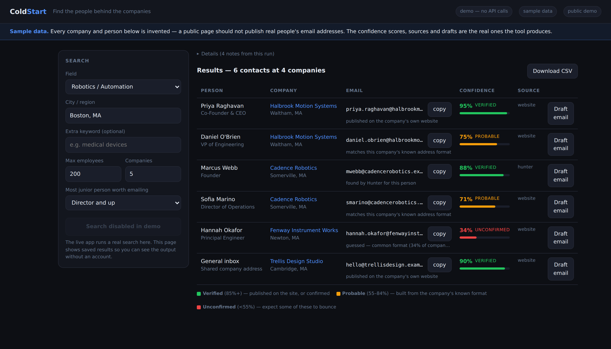

# ColdStart

**Find the people behind the companies.**

[**Live demo →**](https://internship-finder.onrender.com/demo) (sample data, no login)



## The problem

Cold outreach to small companies works — a founder at a 20-person shop reads
their own inbox — but the useful targets are invisible. Job boards list openings
at companies big enough to have job boards. The interesting 10–50 person firms
have no listings, no recruiter, and no obvious way in.

The hard part isn't writing the email. It's getting from *"this company looks
interesting"* to *"here is a person, here is their address, and here is
something true to say to them."* ColdStart does that, and tells you how much to
trust each answer.

Commercial tools (Apollo, RocketReach, Hunter) sell contact data to sales teams
with budgets. This runs on free tiers, filters *for* small companies rather than
against them, and never presents a guess as a fact.

## How it works

```
criteria (field, city, headcount, seniority)
    │
    ├─► discovery ─── Google Places · Apollo · OpenStreetMap → merge by domain
    │
    ├─► per company, in a thread pool:
    │     crawl /team, /leadership, /about   → name + title pairs, ranked 1–5
    │     Hunter domain-search               → the company's address format
    │     pattern inference                  → {f}{last} learned from real data
    │     Hunter email-finder                → that specific person's address
    │     verify                             → syntax → MX → Hunter verifier
    │
    └─► ranked contacts → SQLite → web UI / CSV / Gmail draft
```

A search takes a minute or more (one request per host per second, deliberately),
so `POST /api/search` starts a worker thread and returns a job id the page polls.
That's also why it runs **one gunicorn worker with threads** — the job registry
lives in process memory.

## Data sources, and why each

| Source | Why it's here |
|---|---|
| **Google Places** | Best recall for local businesses by far. Took a Boston search from 4 candidates to 37. |
| **Hunter.io** | The only cheap way to learn a company's address format. Turns a 20%-confidence guess into an 85% derived address. |
| **Company websites** | Small companies list their leadership publicly. This is the free path, and often the most accurate one. |
| **Apollo** | The only source with a true employee-count filter. Optional. |
| **OpenStreetMap** | Free, no key — but both public Overpass mirrors time out routinely, so it's **off by default**. |
| **LinkedIn** | Deliberately not scraped. It breaks their terms and gets accounts banned; profile URLs go to RocketReach's API instead. |

## The confidence model

Every address carries a score and a plain-English basis, because the difference
between them is the difference between a reply and a bounce.

| Tier | Score | Where it came from |
|---|---|---|
| **Verified** | 85%+ | Published on the company's own site, or confirmed by Hunter |
| **Probable** | 55–84% | Built from a pattern proven by a real address at that domain |
| **Unconfirmed** | <55% | Base-rate guessing. **Off by default** — these bounce |

This distinction is the whole point. A bounce on a cold introduction doesn't just
fail, it spends a contact you only get to approach once. So the tool would rather
return three addresses it can stand behind than twenty it can't, and the UI colours
them so a guess can never be mistaken for a verified address.

Tiering is driven by the score, not by which provider supplied it — Hunter
returning something at 74% is still a 74% address.

## Drafting

The draft button reads the company's own site, pulls out a sentence making a
checkable claim, and references it in plain language: *"What interests me about
Halbrook is your work on direct-drive linear stages for semiconductor
inspection."* Never a block quote — pasting a company's marketing copy back at
the person who wrote it is worse than saying nothing.

The ask adapts to seniority: founders and VPs get a direct internship ask;
directors and engineers get a question about their work and no ask, because
asking them for a job is asking the wrong person.

Gmail integration saves drafts and **cannot send** — the OAuth scope is
`gmail.compose`, asserted by a test.

If research finds nothing specific, it **refuses to draft** rather than
returning something generic.

## Architecture

```
app.py               Flask UI + JSON API, password gate, rate limits, /demo
cli.py               command-line entry point
finder/
  pipeline.py        orchestration, background jobs, per-run API budgets
  companies.py       discovery, merging, size + directory filtering
  people.py          site crawl, name/title extraction, seniority ranking
  emails.py          harvesting, pattern inference, candidate generation
  verify.py          syntax / MX / Hunter verifier / optional SMTP
  research.py        reads a site for specific, quotable claims
  outreach.py        drafting, phrasing, and the refusal rules
  providers.py       Hunter, Apollo, RocketReach, Places + 30-day cache
  store.py           SQLite: searches, contacts, cache, rate limits, tokens
```

Free tiers are small and the app is public, so spend is capped in five
independent places: a 30-day provider cache, per-run lookup budgets, a daily
rate limit counted per session *and* per IP, a server-side cap on companies per
search, and a quota gate that disables searching when Hunter runs low.

## Engineering notes

**A wrong parameter that returned plausible output.** Every Hunter lookup was
failing with a 400, and had been from the first commit — I passed `limit=25`
against a free tier that caps results at 10. The failure was invisible because
the code degraded exactly as designed: no pattern returned, fall back to
base-rate guessing, emit an address. Every result looked reasonable and every
result was a guess. Two things hid it: provider errors were recorded per-company
and never surfaced, and the fallback was good enough to look like success. The
fix was one clamped integer; finding it took surfacing the errors first. **A
silent fallback is a bug that reports itself as working.**

**The wrong shape of text.** Research returned nothing on modern company sites.
The extractor called `get_text(" ")` on the whole page, which is correct for
prose and useless for marketing sites — those are headings and divs with almost
no full stops, so the entire page collapsed into one 300-character run-on that
the length filter then discarded. Reading block by block instead recovers the
one sentence that mattered. The lesson wasn't about BeautifulSoup: my mental
model was *pages contain prose*, and real pages contain layout.

**Refusing to produce output.** The drafts kept coming out subtly wrong —
`Hi M Dinne,` from a mangled name, *"your work on the in-house capabilities
include…"* from a truncated services list. Each had its own fix, but the pattern
was that a nearly-right email is worse than none: it costs a contact you can
only approach once, and it reads as automated in a way that no partial fix
prevents. So the drafter now refuses — on an untrustworthy first name, on
research that found nothing specific, and on any body failing a final grammar
check — and explains why instead of handing back something to fix by hand.
**Knowing when not to answer is a feature.**

## What I'd build next

- **Headless-browser fetch** for JavaScript-rendered sites, which currently
  return nothing and are correctly but unhelpfully refused.
- **Bounce feedback**: mark an address dead and automatically re-rank the
  alternates for that domain.
- **Warm-intro detection** — flag contacts who share a school or employer.
- **Postgres** instead of SQLite, so the cache and outreach history survive a
  deploy on Render's ephemeral filesystem.

## Running it

```bash
python3 -m venv .venv && source .venv/bin/activate
pip install -r requirements.txt
echo "APP_PASSWORD=whatever" > .env
python app.py          # or: python demo.py — offline, no keys, no network
```

Everything is configured by environment variable; see `.env.example`. No key is
required to run — with none configured you get OpenStreetMap plus site crawling.
`.env` is gitignored and no key appears anywhere in the repository or its history.

```bash
python -m unittest discover -s tests    # 186 tests, all offline
```

Most of those tests exist because something broke in a live run, and several
contain the literal strings that broke it: `PhD CEO & Chairman`,
`LEED AP BD+C President Boston`, `Supply Chain`, `M Dinne Flansbury`,
`Welcoming Hiten Sonpal: RISE Robotics' New CEO`.

## Provenance

The code was written with [Claude Code](https://claude.com/claude-code). I
specified the behaviour, ran it against real companies, found the bugs described
above from its actual output, and directed the fixes. The engineering notes are
my diagnoses of failures I hit while using it, not a summary of the commit log.

## Scope

For sending individual, personal emails. Honours `robots.txt`, rate-limits
itself to one request per host per second, identifies itself with a real contact
address, and skips directory sites that list other companies' people.
Bulk-mailing scraped addresses is a different activity with different laws
around it, and this is not built for it.
